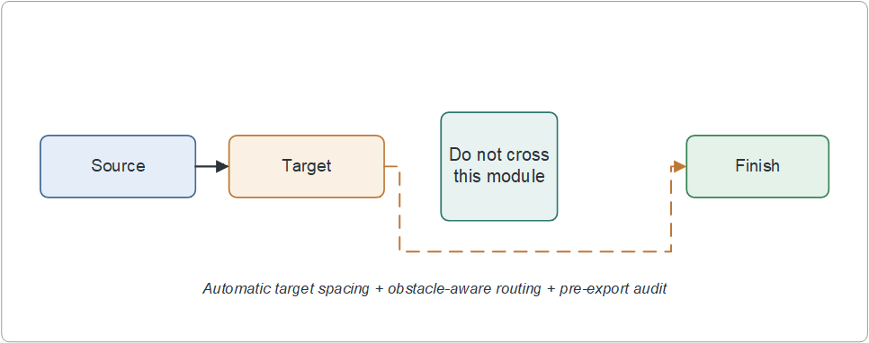

# Visio MCP SCI

A Windows MCP server for creating fully editable Microsoft Visio diagrams with
compact SCI/IEEE styling, native arrowheads, obstacle-aware routing, and a
pre-export geometry audit.



## Why this fork exists

General-purpose Visio automation can produce valid diagrams that still have
publication problems: touching controls hide arrowheads, hand-routed polylines
cross text, decision diamonds become too tall, and dense figures use inconsistent
colors or typography. Visio MCP SCI turns those concerns into reusable defaults
and executable checks.

## Highlights

- 56 MCP tools covering documents, pages, primitives, stencils, connectors,
  alignment, export, and diagram inspection.
- `sci_compact` profile with print-friendly, low-saturation semantic colors.
- Flat editable diamonds (`1.20 × 0.54 in` by default).
- Arial 9.5 pt body text and 10 pt multi-line text with 115% line spacing.
- Native Visio `BeginArrow` / `EndArrow` properties—no triangle helper shapes.
- Automatic minimum clearance before AutoConnect, preventing hidden arrowheads.
- Obstacle-aware orthogonal routing with perpendicular terminal segments.
- Side-center attachment zones that exclude rounded corners.
- A 0.12-inch straight terminal stub before the first and final 90-degree turn.
- Layout audit for control overlap, insufficient gaps, short connectors,
  connector crossings, corner attachments, diagonal terminals, and premature bends.
- Strict scientific export that refuses to export a figure that fails the audit.
- Semantic roles stored as Visio Shape Data, so validation survives save/reopen.

## Requirements

- Windows 10 or 11
- Desktop Microsoft Visio
- Python 3.10 or newer

The currently verified local runtime is Python 3.12.12.

## Install

```powershell
git clone https://github.com/2924547961/visio-mcp-sci.git
cd visio-mcp-sci
python -m venv .venv
.\.venv\Scripts\Activate.ps1
python -m pip install -e .
```

## MCP configuration

Codex `config.toml`:

```toml
[mcp_servers.visio]
command = "C:\\path\\to\\visio-mcp-sci\\.venv\\Scripts\\python.exe"
args = ["-m", "visio_mcp"]
startup_timeout_sec = 120
```

JSON-based MCP clients:

```json
{
  "mcpServers": {
    "visio": {
      "command": "C:\\path\\to\\visio-mcp-sci\\.venv\\Scripts\\python.exe",
      "args": ["-m", "visio_mcp"]
    }
  }
}
```

Restart the MCP client after changing its configuration.

## Safe scientific workflow

1. Call `get_scientific_figure_standard("sci_compact")`.
2. Create shapes with `batch_draw_shapes`; assign `semantic_role` values such as
   `backbone`, `exit`, `decision`, `auxiliary`, `highlight`, `accept`, or `reject`.
3. Connect ordinary neighbors with `batch_connect_shapes`. Its defaults
   `enforce_clearance=true` and `enforce_perpendicular=true` automatically
   separate touching controls and select right-angle routing when needed.
4. Use `draw_safe_orthogonal_connector` for branches that pass near other modules.
5. Call `audit_scientific_layout` and fix every reported issue.
6. Use `export_scientific_figure` for final SVG/PNG export. Strict mode blocks
   export if either errors or warnings remain.

Example obstacle-aware branch:

```json
{
  "from_shape_id": 12,
  "to_shape_id": 19,
  "obstacle_ids": [14, 15, 16],
  "preferred_axis": "horizontal",
  "clearance": 0.12,
  "terminal_stub": 0.12,
  "role": "decision_flow"
}
```

## Connector geometry invariants

Every publication connector follows these rules:

1. Attach in the center region of a shape side, outside the rounded-corner zone.
2. Leave and enter the attached side along its normal (perpendicular) direction.
3. Keep at least 0.12 in of straight terminal line before any 90-degree bend.
4. Use a straight connector only when the two attachment points are axis-aligned.
5. Use native Visio line patterns and arrowheads; never add triangle shapes.

`audit_scientific_layout` reports violations as
`connector_attaches_near_corner`, `connector_terminal_not_perpendicular`, or
`connector_terminal_stub_too_short`. Strict export blocks all three.

## Compact SCI defaults

| Property | Default |
|---|---:|
| Horizontal gap | 0.18 in |
| Vertical gap | 0.16 in |
| Minimum control/arrow gap | 0.14 in |
| Connector clearance | 0.12 in |
| Straight terminal stub | 0.12 in |
| Rounded-corner exclusion | 0.10 in |
| Flat diamond | 1.20 × 0.54 in |
| Body / multi-line text | 9.5 / 10 pt |
| Multi-line spacing | 115% |
| Data flow | charcoal solid, 1.1 pt |
| Decision flow | ochre dashed, 1.0 pt |

All shapes, polylines, and connectors remain editable native Visio objects.

## Publication-style basis

The defaults follow common publisher requirements: editable vector artwork,
standard fonts, minimal whitespace, restrained colors, clear line work, and no
decorative effects. See the official
[Nature figure guide](https://research-figure-guide.nature.com/figures/preparing-figures-our-specifications/),
[IEEE graphics guidance](https://journals.ieeeauthorcenter.ieee.org/create-your-ieee-journal-article/create-graphics-for-your-article/resolution-and-size/),
and [Elsevier artwork guidance](https://www.elsevier.com/en-gb/about/policies-and-standards/author/artwork-and-media-instructions/artwork-types).

## Validation

Unit tests that do not launch Visio:

```powershell
python -m unittest discover -s tests -p "test_*.py"
```

Windows + Visio integration smoke test:

```powershell
python tests\integration_layout_safety.py
```

## License and attribution

MIT licensed. This repository is derived from the MIT-licensed `visio-mcp`
0.1.2 distribution by `yushun`; see [NOTICE.md](NOTICE.md) and [LICENSE](LICENSE).
